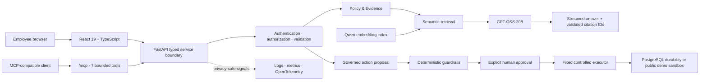

# OpenWeight

## Enterprise LLM Governance Platform

OpenWeight demonstrates how an enterprise AI system can answer questions from
governed internal evidence and propose consequential actions without treating
the language model as an authorization boundary.

**Designed and built by Joseph A. Terry.**

[](https://github.com/JosephATerry/openweight/actions/workflows/ci.yml)

**[Open the live application](https://josephaterry-openweight.hf.space)** ·
[Hugging Face project](https://huggingface.co/spaces/josephaterry/openweight) ·
[GitHub repository](https://github.com/JosephATerry/openweight)

## Why OpenWeight

Enterprise AI has to do more than generate plausible text. It must show what
evidence supports an answer, preserve policy scope, enforce authorization, and
keep consequential changes under deterministic and human control.

OpenWeight brings those concerns into one product experience. It is not merely
a RAG chatbot: it combines grounded policy assistance with a governed action
workflow that separates what a model proposes from what the system permits and
executes.

## Core workflows

### Policy & Evidence

```text
employee question
    -> semantic retrieval over internal policy evidence
    -> GPT-OSS grounded generation
    -> streamed final answer
    -> validated citation IDs and supporting evidence
```

Employees can ask free-form policy and access-governance questions. Relevant
evidence is retrieved with Qwen embeddings and supplied to GPT-OSS 20B. The UI
progressively renders only final-answer content, then presents validated
citations and the evidence used by the answer. When the retrieved internal
evidence is insufficient, OpenWeight abstains instead of silently answering
from general model knowledge or falling back to web search.

### Governed Actions

```text
model or employee proposal
    -> deterministic action and argument validation
    -> authorization and policy checks
    -> explicit human approval
    -> fixed controlled executor
    -> auditable result with replay protection
```

OpenWeight demonstrates this boundary with access-request status changes. A
proposal does not perform a write. Only an explicitly approved, allowlisted
action can reach the fixed executor; rejection has no operational effect.

## Try the live demo

Visit **[josephaterry-openweight.hf.space](https://josephaterry-openweight.hf.space)**.

1. Open **Policy & Evidence** and ask: _“When can break-glass credentials be
   used?”_
2. Review the streamed answer, inline citations, and Supporting Evidence cards.
3. Switch the **Demo Persona** to Operator and open **Access Requests**.
4. Create a status-change proposal and confirm that no change has executed yet.
5. Open **Approvals**, review the proposed transition, and explicitly approve or
   reject it.
6. Visit **System** for the runtime, MCP, security, and deployment view.

The public application uses synthetic policy and access-governance data. Demo
Persona changes the walkthrough interface only; it is not authentication. The
public action and approval state is process-local and resets when the Space
restarts.

## Architecture



FastAPI remains the normal product/API boundary. MCP is an additional
interoperability surface over the same services; it is not a parallel agent,
security system, database layer, or execution gateway.

## Security invariant

> **The model is not the security boundary.**

```text
model proposal
    ↓
deterministic validation / guardrails / policy checks
    ↓
explicit human approval
    ↓
controlled executor
    ↓
audit / observability
```

Model output cannot authorize itself. Backend policy and role checks remain
authoritative, approval resumes only the already-fixed proposal, and the
executor accepts one narrow parameterized mutation rather than arbitrary SQL,
shell commands, tool names, or write payloads.

## Grounded AI design

- **Primary model:** `openai/gpt-oss-20b` is the default and reference
  generation backend.
- **Semantic retrieval:** `Qwen/Qwen3-Embedding-0.6B` retrieves from 12
  synthetic policy documents. The portable public index contains 49 chunks
  with 1,024-dimensional embeddings.
- **Grounding boundary:** the generation prompt permits only supplied evidence,
  preserves policy/domain scope, and requires citations adjacent to supported
  claims.
- **Safe streaming:** the browser receives only employee-facing final-answer
  content. Prompts, chain-of-thought/reasoning, traces, control tokens, and
  retrieval internals are not streamed.
- **Abstention:** insufficient internal evidence produces a bounded abstention;
  the public policy flow does not silently invoke Tavily, web search, or general
  model knowledge.
- **Evidence review:** citation IDs are validated against the retrieved evidence
  set before citation controls and Supporting Evidence cards are rendered. This
  verifies source-ID membership, not semantic entailment; users should still
  review the cited passage.

## Governed action design

LangGraph supplies the interruption/resume boundary for human approval. The
proposal records a fixed action before interruption, and the resume request
cannot replace its arguments.

In PostgreSQL mode, durable checkpoints and approval sessions are combined with
row locking and a transactional execution ledger. An effect ID is claimed in
the same transaction as the one controlled access-request status mutation and
its stored result. This provides replay protection for that narrowly defined
database effect; it is not a claim of universal distributed exactly-once
execution.

The public Space demonstrates the same proposal, approval, rejection, and
controlled-execution semantics against synthetic process-local state. Its
replay record and pending approvals reset on process restart; production
durability is represented by the PostgreSQL architecture, not by the public
demo sandbox.

## Deployment postures

| Posture | Inference and retrieval | Identity and state | Status |
| --- | --- | --- | --- |
| **Full local engineering** | Local GPT-OSS 20B; Qwen embeddings; PostgreSQL/pgvector policy store | Configurable JWT/RBAC; PostgreSQL checkpoints, approvals, and execution ledger | Implemented; local model execution requires suitable GPU resources and model artifacts |
| **Public Hugging Face demo** | CPU-hosted React/FastAPI shell; remote GPT-OSS through Hugging Face Inference Providers and Groq; portable Qwen index | Simulated Demo Persona; synthetic process-local action/approval state | Live recruiter walkthrough; intentionally ephemeral and not a production identity system |
| **Azure production reference** | External inference boundary; managed PostgreSQL/pgvector | OIDC/JWT, managed identities, Key Vault, durable approval/audit state | Terraform reference architecture only; no Azure environment is deployed |

The public profile performs no startup, background, warm-up, or health-check
inference. Metered requests have a finite timeout, zero application retries,
no provider fallback, conservative per-client rate limits, and a global
concurrency limit.

## Engineering highlights

| Area | Implementation |
| --- | --- |
| Product UI | React 19, TypeScript, React Router, accessible responsive components, safe limited Markdown |
| Service boundary | FastAPI, strict Pydantic contracts, sanitized errors, server-sent answer streaming |
| AI and retrieval | GPT-OSS 20B, Qwen embeddings, PostgreSQL/pgvector, reproducible portable vector index |
| Workflow control | LangGraph interruption, explicit approval, fixed executor, transactional replay protection |
| Identity | Optional RS256 OIDC/JWT validation with Reader, Approver, and Operator permissions |
| Interoperability | MCP 2026-07-28 using the official `mcp==2.1.1` SDK and seven bounded tools |
| Observability | Structured JSON logs, Prometheus metrics, OpenTelemetry traces, privacy-safe request correlation |
| Delivery | Multi-stage non-root Docker image, GitHub Actions CI, deterministic Space export, keyless deployment |
| Cloud reference | Terraform for Azure Container Apps, PostgreSQL, Key Vault, managed identities, and observability |

## CI/CD

```text
push or pull request
    -> model-free application tests
    -> frontend typecheck, lint, tests, and production build
    -> dependency audits and tracked-file secret scan
    -> deterministic Space-export validation
    -> container build and non-inference smoke tests

successful current main revision
    -> GitHub Environment boundary
    -> GitHub Actions OIDC
    -> Hugging Face Trusted Publisher
    -> short-lived repository-scoped deployment token
    -> josephaterry/openweight rebuild
```

Pull requests never deploy. The deployment workflow rechecks that the tested
commit is still current `main`, serializes releases, and receives no Space
runtime inference secret. GitHub stores no long-lived Hugging Face deployment
token.

## Run locally

The quickest non-inference product/container check uses Docker Compose:

```bash
cp .env.example .env
# Replace the local PostgreSQL placeholder values in .env.
docker compose up --build --detach postgres api
```

Then open `http://127.0.0.1:8000/`. See the
[container guide](docs/containers.md) for initialization, health checks, and
cleanup.

The complete local Policy & Evidence path additionally requires PostgreSQL
policy indexing, the pinned Qwen embedding model, local GPT-OSS 20B model
artifacts, and suitable GPU capacity. It is deliberately not presented as a
lightweight quickstart. See the [service API guide](docs/service_api.md) and
[frontend guide](docs/frontend.md) for the application boundaries and
development workflow.

## Security, privacy, and limitations

- All data visible in the public demo is synthetic; public action and approval
  state is ephemeral.
- Demo Persona is a role-oriented UI simulation, not production authentication
  or an authorization boundary.
- The full service supports bounded OIDC/JWT roles, but enterprise identity is
  not enabled in the public Space.
- OpenWeight does not currently claim document-level access-control filtering
  within the policy corpus.
- Citation-ID validation confirms that a cited chunk was retrieved; it does not
  prove that every generated claim semantically follows from that chunk.
- Consequential actions require deterministic controls outside the model and
  are limited to the fixed access-request workflow.
- The public policy flow does not silently fall back to Tavily, web search, or
  unsupported general knowledge.
- Prompts, model responses, reasoning, retrieved document text, credentials,
  database URLs, and personal data are excluded from application telemetry.
- The public Space is a bounded recruiter demo, not the Azure production
  architecture. No Azure environment is currently deployed.

## Documentation

- [Frontend and product UX](docs/frontend.md)
- [Service API and grounded-policy contracts](docs/service_api.md)
- [Approval durability and transactional replay protection](docs/approval_durability.md)
- [Authentication, authorization, and security](docs/security.md)
- [Model Context Protocol interface](docs/mcp.md)
- [Logs, metrics, traces, and privacy](docs/observability.md)
- [Hugging Face recruiter-demo profile](docs/huggingface.md)
- [Public CI/CD and Trusted Publishing](docs/ci_cd.md)
- [Local containers](docs/containers.md)
- [Azure reference architecture](docs/azure_architecture.md)
- [Terraform Azure implementation](infra/terraform/README.md)

## Experimental model engineering

Muse Glimmer remains an experimental backend and training-engineering case
study. It is not the default production/reference model, has not replaced
GPT-OSS, and is not presented here with comparative model-performance claims.

## Author

**Designed and built by Joseph A. Terry.**

- GitHub: [JosephATerry](https://github.com/JosephATerry)
- Hugging Face: [josephaterry](https://huggingface.co/josephaterry)

---

© 2026 Joseph A. Terry. All rights reserved.
