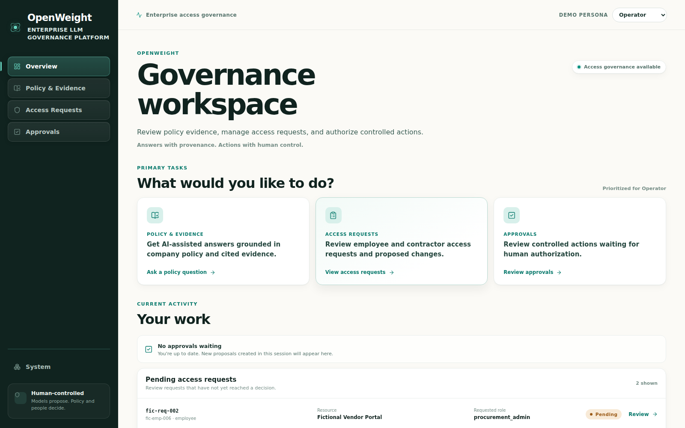
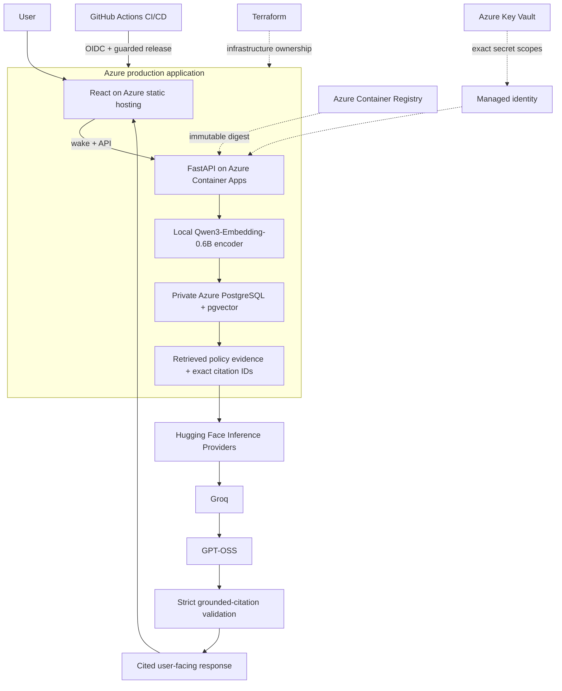
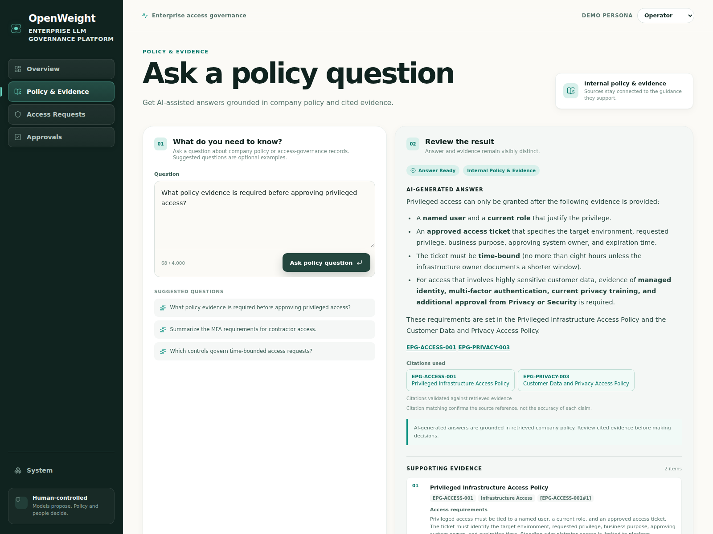
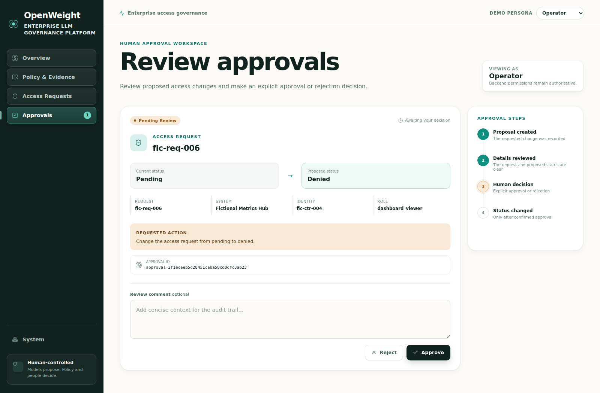

# OpenWeight

**A production-oriented governed AI platform that retrieves internal policy evidence, generates with GPT-OSS, and returns only strictly validated, cited answers.**

**Designed and built by Joseph A. Terry.**

[](https://github.com/JosephATerry/openweight/actions/workflows/ci.yml)
[](https://github.com/JosephATerry/openweight/actions/workflows/deploy-azure.yml)

### Live demos

**[Live Azure Demo — primary production deployment](https://stowpdemocusjat060015f.z19.web.core.windows.net)**

> The Azure AI backend scales to zero when idle. The first visit after
> inactivity may take about 30 seconds while the backend starts; OpenWeight
> displays live preparation status during startup.

**[Hugging Face Demo — alternate hosted walkthrough](https://josephaterry-openweight.hf.space)** ·
[Space page](https://huggingface.co/spaces/josephaterry/openweight)



## Overview

OpenWeight demonstrates how an AI application can answer questions from
governed internal evidence without treating the language model as an
authorization or trust boundary. It combines a React product interface,
FastAPI service contracts, local Qwen retrieval embeddings, PostgreSQL/pgvector,
remote GPT-OSS generation, strict citation validation, and controlled human
approval workflows.

The primary deployment runs on Azure Container Apps with a private Azure
PostgreSQL Flexible Server. GPT-OSS inference is provided through Hugging Face
Inference Providers and Groq; Azure hosts the application and retrieval stack,
not the language model itself.

## What it demonstrates

- **Grounded RAG:** local Qwen embeddings retrieve synthetic internal policy
  evidence from PostgreSQL/pgvector before GPT-OSS generation.
- **Fail-closed answers:** every citation must exactly match the retrieved
  source allowlist; missing, unsupported, or fabricated citations are rejected.
- **Bounded correction:** one evidence-bound corrective generation is allowed
  after citation-contract failure, and it must pass the same strict validator.
- **Governed actions:** model or employee proposals pass deterministic policy,
  authorization, approval, and fixed-executor boundaries before any write.
- **Production-oriented delivery:** tested containers, Terraform-managed Azure
  infrastructure, GitHub OIDC, guarded releases, and immutable image digests.
- **Least privilege:** the runtime identity can pull its image and read only the
  exact application database-password and inference-token secrets it needs.

## Architecture



FastAPI remains the product and API boundary. An MCP interface exposes the same
bounded services; it is not a parallel security system, database layer, or
execution gateway.

## How the RAG pipeline works

1. The user asks a policy question in the React UI.
2. The application embeds it with the pinned local
   `Qwen/Qwen3-Embedding-0.6B` encoder.
3. PostgreSQL/pgvector returns relevant internal-policy chunks and their exact
   citation IDs.
4. The evidence-bound prompt is sent through Hugging Face Inference Providers
   to Groq-hosted GPT-OSS.
5. OpenWeight extracts citations and requires every cited ID to belong to the
   retrieved allowlist.
6. A valid grounded answer and its supporting evidence are returned. Otherwise,
   the system abstains or fails closed.



_A GPT-OSS answer grounded in synthetic enterprise policy, with validated
citation IDs and visible supporting evidence._

The browser receives only employee-facing final-answer content. Prompts,
reasoning traces, control tokens, credentials, and retrieval internals are not
streamed or written to application telemetry. Citation membership validation
does not prove semantic entailment, so users should still review the cited
passages.

## Governed actions

```text
model or employee proposal
    -> deterministic action and argument validation
    -> authorization and policy checks
    -> explicit human approval
    -> fixed controlled executor
    -> auditable result with replay protection
```

A proposal never performs a write by itself. Only an explicitly approved,
allowlisted action can reach the fixed executor; rejection has no operational
effect. LangGraph provides the interruption/resume boundary, while PostgreSQL
row locking, approval sessions, and a transactional execution ledger protect
the narrowly defined database effect from replay.



## Production Azure deployment

The verified production path uses:

- Azure Storage static website hosting for an immediately available React UI
  while the Container Apps backend retains scale-to-zero;
- Azure Container Apps for the public FastAPI/Qwen backend;
- Azure Container Registry for Linux/amd64 images pinned by immutable digest;
- Azure PostgreSQL Flexible Server with pgvector on private networking;
- Azure Key Vault and managed identities for secretless workload access;
- Terraform for infrastructure, identities, network boundaries, and service
  configuration;
- a Qwen-preloaded runtime image so retrieval requires no model download at
  application startup.

The runtime identity has only `AcrPull` plus secret-scoped access to the
application database password and Hugging Face inference token. It has no
database administrator, migration, indexing, registry-push, or broad Azure
management privilege.

## CI/CD

```text
push / pull request
    -> model-free application and security tests
    -> workflow and secret checks
    -> frontend validation
    -> container build and isolated smoke tests

explicit production release
    -> successful exact-SHA CI required
    -> protected build + deploy gates
    -> GitHub OIDC to Azure
    -> ACR data-plane publication
    -> Qwen-enabled Linux/amd64 build
    -> immutable digest deployment
    -> Container Apps revision + endpoint verification
    -> independent React build
    -> keyless static publication through OIDC/RBAC
```

No long-lived Azure CI credential is stored in GitHub. Default and automatic
builds remain model-free; a Qwen-enabled production artifact requires explicit
manual intent and both environment gates. The workflow verifies current `main`,
captures the pushed digest, deploys that digest rather than a mutable tag, and
fails closed before Azure login when authorization is disabled.

Hugging Face deployment remains a separate Trusted Publishing path with no
long-lived Space deployment token stored in GitHub.

## Security and grounding

> **The model is not the security boundary.**

- Retrieved citation IDs form an exact allowlist.
- Unsupported or fabricated citations are never rewritten into allowed IDs.
- At most one corrective generation may reuse the same evidence; its result
  must pass the original validator.
- Insufficient evidence produces a bounded abstention rather than unsupported
  general knowledge or silent web-search fallback.
- Consequential actions require deterministic backend checks and explicit human
  approval.
- Public data is synthetic, and telemetry excludes prompts, generated answers,
  retrieved document text, credentials, database URLs, and personal data.
- The service supports bounded OIDC/JWT roles; a demo persona is never treated
  as an authentication assertion.

## Tech stack

| Area | Technology |
| --- | --- |
| Product UI | React 19, TypeScript, React Router, accessible responsive components |
| API | FastAPI, Pydantic, server-sent events, sanitized error contracts |
| Retrieval | Qwen3-Embedding-0.6B, PostgreSQL, pgvector, 1,024-dimensional vectors |
| Generation | Hugging Face Inference Providers → Groq → GPT-OSS 20B |
| Workflow control | LangGraph interruption, explicit approval, fixed executor |
| Cloud | Azure static hosting, Container Apps, ACR, PostgreSQL Flexible Server, Key Vault, managed identities |
| Delivery | Terraform, Docker, GitHub Actions, GitHub OIDC, immutable digests |
| Interoperability | MCP using the official Python SDK and seven bounded tools |
| Observability | Structured logs, Prometheus metrics, OpenTelemetry traces |

## Testing and quality

The real delivery path validates model-free application behavior, grounded-RAG
contracts, authorization boundaries, workflow semantics, dependency
consistency, tracked-file secrets, frontend quality, container construction,
and isolated endpoint smoke tests. Production verification has also confirmed:

- a healthy Azure Container Apps revision;
- HTTP 200 from `/healthz` and ready status from `/readyz`;
- PostgreSQL and pgvector retrieval readiness;
- a working public frontend;
- a full Qwen retrieval → GPT-OSS generation → supported-citation response;
- least-privilege runtime access; and
- Terraform/CD ownership that permits CD to manage only the runtime image.

No load, scale, SLA, or comparative model-performance claim is made.

## Running locally

The quickest non-inference product/container check uses Docker Compose:

```bash
cp .env.example .env
# Replace the local PostgreSQL placeholder values in .env.
docker compose up --build --detach postgres api
```

Then open `http://127.0.0.1:8000/`. See the
[container guide](docs/containers.md) for initialization, health checks, and
cleanup.

The complete local Policy & Evidence path additionally requires PostgreSQL
policy indexing, the pinned Qwen embedding model, local GPT-OSS 20B artifacts,
and suitable GPU capacity. It is intentionally not presented as a lightweight
quickstart. See the [service API guide](docs/service_api.md) and
[frontend guide](docs/frontend.md) for development details.

## Repository structure

```text
src/openweight_platform/   FastAPI, RAG, security, orchestration, and services
frontend/                  React/TypeScript application
infra/terraform/           Staged Azure infrastructure and lifecycle
deploy/huggingface/        Deterministic Hugging Face Space export
docker/                    API and PostgreSQL container support
scripts/                   Migration, indexing, export, and operational tools
tests/                     Application, security, workflow, and infrastructure tests
docs/                      Architecture, API, security, deployment, and UX guides
```

## Deployment options

| Posture | Inference and retrieval | Purpose |
| --- | --- | --- |
| **Azure production** | Local Qwen encoder; private PostgreSQL/pgvector; HF Inference Providers → Groq → GPT-OSS | Primary live deployment and validated production E2E |
| **Hugging Face Space** | Hosted React/FastAPI demo; remote GPT-OSS; portable synthetic retrieval profile | Alternate recruiter walkthrough with intentionally ephemeral demo state |
| **Local engineering** | Local Qwen and GPT-OSS artifacts; PostgreSQL/pgvector | Full development path for appropriately provisioned hardware |

Try the alternate **[Hugging Face demo](https://josephaterry-openweight.hf.space)**
to explore Policy & Evidence, demo-persona access requests, explicit approvals,
and the System view. Demo Persona changes the walkthrough interface only; it
is not authentication, and process-local demo action state resets on restart.

## Project status

**Production deployment and essential E2E verification are complete.** The
Azure application, real CI/CD path, private database retrieval, Qwen encoder,
GPT-OSS inference, strict citation validation, public frontend, and runtime
least-privilege boundaries have all been exercised successfully.

The project uses synthetic policy and access-governance data. It does not claim
document-level corpus authorization, production load testing, availability
SLAs, or universal exactly-once execution.

## Documentation

- [Frontend and product UX](docs/frontend.md)
- [Service API and grounded-policy contracts](docs/service_api.md)
- [Approval durability and transactional replay protection](docs/approval_durability.md)
- [Authentication, authorization, and security](docs/security.md)
- [Model Context Protocol interface](docs/mcp.md)
- [Logs, metrics, traces, and privacy](docs/observability.md)
- [Hugging Face deployment](docs/huggingface.md)
- [CI/CD](docs/ci_cd.md)
- [Local containers](docs/containers.md)
- [Azure architecture](docs/azure_architecture.md)
- [Terraform Azure implementation](infra/terraform/README.md)

## Experimental model engineering

Muse Glimmer remains an experimental backend and training-engineering case
study. It is not the production/reference model, has not replaced GPT-OSS, and
is not presented with comparative model-performance claims.

## Author and license

**Designed and built by Joseph A. Terry.**

- GitHub: [JosephATerry](https://github.com/JosephATerry)
- Hugging Face: [josephaterry](https://huggingface.co/josephaterry)

© 2026 Joseph A. Terry. All rights reserved.
