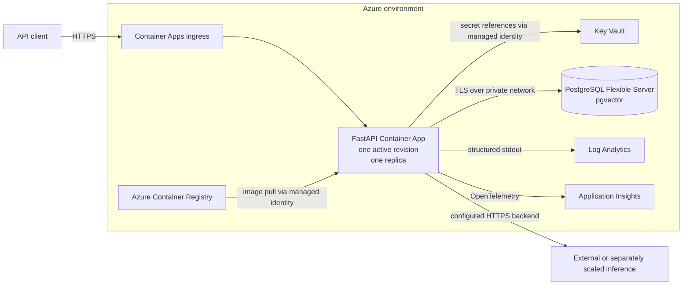
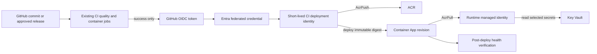
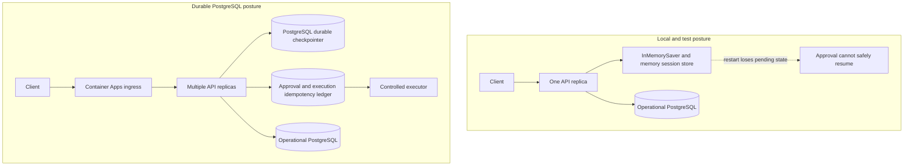
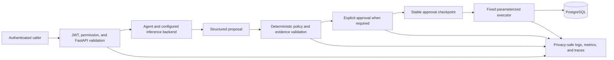

# Azure deployment reference architecture

## Purpose and status

This document defines the Azure reference architecture for the existing
containerized FastAPI/LangGraph service. It is an implementation contract for
the later infrastructure-as-code stage, not evidence of a deployed system.
No Azure resource, identity, credential, GitHub federation, or deployment is
created by this design.

D14 subsequently implemented the application-side PostgreSQL checkpoint,
approval-session, transactional effect ledger, OIDC/JWT authorization, TLS,
and parameterized CI-federation foundations described here. No live Azure or
GitHub trust was created, and the reference deployment remains one replica
until its real database bootstrap and multi-replica behavior are verified.

The design favors a realistic, reproducible portfolio deployment with bounded
cost and operational complexity. Azure Container Apps is preferred over AKS:
the application is one HTTP service, has no Kubernetes-specific requirement,
and benefits from managed ingress, revisions, health probes, and autoscaling.

## Current application constraints

The architecture preserves the application that already exists rather than
introducing a parallel cloud-specific service:

- `openweight_platform.api` is a thin FastAPI boundary over the existing
  backend factory, LangGraph orchestration, policy retrieval, PostgreSQL
  services, approval flow, and controlled executor.
- The runtime image is CPU-only, runs as UID/GID `10001:10001`, and starts with
  `python -m openweight_platform.api.run`. It contains no model weights or
  training environment.
- Configuration is environment-driven. Backends are lazy and are not loaded at
  import or process startup.
- PostgreSQL stores operational data and pgvector policy embeddings. Fictional
  operations data and policy indexing are explicit setup steps, not API startup
  side effects.
- `/healthz` is process liveness. `/readyz` reports sanitized dependency
  readiness. `/metrics` is hidden from product OpenAPI and can be public for
  local work, bearer-protected, or disabled for cloud ingress.
- Logs are structured JSON on stdout. Metrics and OpenTelemetry attributes use
  bounded, privacy-safe fields; prompts, responses, reasoning, document text,
  credentials, and database URLs are excluded.
- Local/test approval state can use `InMemorySaver`; production-capable
  configuration uses LangGraph `PostgresSaver`, durable row-locked approval
  sessions, and a transactional execution-effect ledger.
- The only consequential operation exposed by the service is the fixed,
  parameterized access-request status transition behind proposal validation,
  LangGraph interruption, and explicit approval. There is no arbitrary SQL,
  tool, or write route.
- CI currently tests and builds the application but has no remote and performs
  no deployment.

The reference stays at one API replica until live bootstrap/load validation,
despite the shared durability implementation. An external model endpoint
remains the practical cloud default: the 30B model must not be placed in the
API container.

## Recommended Azure runtime architecture

### Resource inventory

The minimum Azure deployment consists of the following resources in one
environment-specific resource group:

| Resource | Purpose | Initial posture |
|---|---|---|
| Azure Container Registry | Stores versioned API images | Basic tier where adequate; admin user disabled |
| Container Apps managed environment | Runtime boundary and revision management | One environment per Azure environment |
| Azure Container App | Runs the FastAPI image | External HTTPS ingress; one active revision; one replica |
| User-assigned managed identity | Runtime Azure identity | ACR pull and Key Vault secret-read only |
| Azure Database for PostgreSQL Flexible Server | Operational data, policy vectors, future checkpoints | TLS, private connectivity, backups enabled |
| Azure Key Vault | Runtime secrets | RBAC authorization; Container App identity reads only required secrets |
| Log Analytics workspace | Container and platform logs | Bounded retention and ingestion controls |
| Application Insights | Application traces and request telemetry | OpenTelemetry boundary; sampling enabled |
| Virtual network and subnets | Private database path | Separate Container Apps infrastructure and PostgreSQL delegated subnets |
| PostgreSQL private DNS integration | Resolves the private database endpoint | Linked only to the required virtual network |

No Redis, AKS cluster, MLflow server, bundled model server, frontend, API
Management instance, Front Door profile, or permanent GPU is required for the
initial reference architecture.

### Container App

Deploy one Container App for the API. A second application service is not
justified until a frontend or separate inference service actually exists.
The later frontend may be a static host or separate Container App and should
consume the same versioned API contract; D12 does not choose or implement it.

The Container App contract is:

- pull an immutable image from ACR, preferably by digest; retain a human-readable
  Git SHA tag for traceability;
- run the existing non-root image and entrypoint;
- set `OPENWEIGHT_API_HOST=0.0.0.0` and an environment-configured target port
  (initially `8000`);
- expose HTTPS ingress and redirect or reject plaintext traffic at the managed
  ingress boundary;
- map liveness to `/healthz` and readiness to `/readyz`, with conservative
  initial delays and failure thresholds;
- use single-revision mode initially so a failed revision does not receive
  approval traffic and the previous healthy revision remains a rollback target;
- set CPU, memory, request timeout, and connection limits from Terraform
  variables, then tune from observed telemetry rather than embedding them in
  application code;
- set `min_replicas=1` and `max_replicas=1` until the implemented durable
  approval/idempotency path is bootstrapped and load-validated in Azure;
- make the filesystem disposable and store no authoritative application state
  in the container.

`/healthz` must stay independent of model generation, database writes, and
telemetry export. `/readyz` may report sanitized database/backend configuration
state but must not perform a consequential operation.

### Container Registry and image promotion

ACR is the image system of record. Disable its admin account. The future
pipeline will build the existing production Dockerfile once, tag it with the
source commit, push it through a narrowly authorized CI identity, and deploy
the resulting immutable digest. The Container App runtime identity receives
`AcrPull`; it does not receive push or registry-administration permissions.

Promotion must identify the same digest across environments. Rebuilding a
nominally identical tag for production would weaken provenance and is not the
recommended flow.

## CI/CD trust and identity separation

There is currently no Git remote. Future repository and environment names are
therefore placeholders, not assumed facts:

- repository subject: `<github-owner>/<github-repository>`;
- protected environment: `<github-environment>`;
- deployment branch/tag policy: defined when the remote and governance exist.

The future deploy job should request `id-token: write` and `contents: read`,
exchange the GitHub OIDC token for a short-lived Microsoft Entra token, and use
an environment-scoped federated credential. A long-lived
`AZURE_CLIENT_SECRET` is not the preferred design.

Identity boundaries:

| Identity | Required access | Explicitly not granted |
|---|---|---|
| GitHub CI federated identity | `AcrPush` on the target registry; narrowly scoped Container Apps deployment rights on the target environment/app | Subscription Owner, database data access, Key Vault secret-value read, runtime API permissions |
| Container App user-assigned identity | `AcrPull`; `Key Vault Secrets User` on the application vault; any later service access individually justified | Registry push, deployment rights, broad resource-group Contributor, GitHub access |
| Migration/indexing identity | Database schema/data privileges required by the one-off operation | Container App deployment or registry administration |

The exact built-in or custom deployment role must be resolved and tested in
the security implementation stage. It should be scoped to the target resource,
not granted at subscription scope merely for convenience.

## PostgreSQL and pgvector

Use Azure Database for PostgreSQL Flexible Server. The reference architecture
uses private connectivity from the Container Apps environment, TLS in transit,
managed backups, and an application role with only the required schema/data
privileges.

The current application authenticates with a database username and password.
For the first implementation, store the password in Key Vault and expose it to
the app through a Container Apps secret reference. Never put it in Terraform
source, a tfvars file committed to Git, the image, or GitHub workflow YAML.
Microsoft Entra authentication for PostgreSQL is a desirable later improvement,
but the application would first need explicit token acquisition/renewal support;
this design does not claim it already exists.

The current database configuration also needs an explicit enforceable TLS
connection-mode/CA contract before a production claim is made. D13 may
provision the TLS-only server, but the application security stage must add and
test the corresponding client setting (prefer certificate verification where
the selected driver and Azure certificate chain allow it).

For pgvector, Terraform and the migration process must:

1. select a PostgreSQL version and Azure region that support the `vector`
   extension;
2. allowlist `vector` through the server's `azure.extensions` configuration;
3. execute `CREATE EXTENSION IF NOT EXISTS vector` through the controlled
   migration path;
4. verify extension availability before policy indexing.

Schema creation and upgrades should run as an explicit one-off migration job or
release step using a separate migration credential. The API must not acquire
schema-owner rights or run migrations at every startup.

`scripts/setup_operations.py` remains an opt-in demo/dev initialization step
for fictional data. It must never be silently applied to a production database.
Policy indexing remains a separate, idempotent one-off job because it requires
an embedding backend; it is not a health probe or API startup action. Database
backup retention, point-in-time restore settings, maintenance window, and
optional zone-redundant high availability are environment parameters. The demo
environment may omit HA for cost; a production reference must revisit it based
on recovery objectives.

## Durable approval state and idempotency

Local/test mode remains process-local. PostgreSQL mode now combines LangGraph's
supported saver, a durable approval-session record, row-level resume locking,
and a transactional execution ledger. The deployment must bootstrap those
schemas before enabling durable mode and must never silently fall back to
memory.

The application integrates `PostgresSaver` and a separate D14-owned approval
session/ledger schema. Merely provisioning PostgreSQL is still insufficient:
the migration/bootstrap command must run and the runtime role must hold the
narrow required grants.

Before `max_replicas` exceeds one, deployment work must verify:

- the durable checkpointer tables and least-privilege role;
- a durable approval/session record containing stable approval and thread IDs;
- an execution idempotency key and database uniqueness constraint;
- a transactional claim/state transition so only one replica can execute an
  approved effect;
- resume behavior that recovers the stored terminal result after an interrupted
  session completion;
- real Azure connection limits plus concurrency, restart, rollback, and retry
  behavior under load.

The effect ledger provides exactly-once behavior for the one controlled
PostgreSQL status effect; it is not a generic distributed transaction or an
authorization mechanism for other writes.

## Networking and public surface

### Reference/default topology

- Internet clients reach only the Container App HTTPS ingress.
- The Container Apps managed environment uses a dedicated infrastructure
  subnet.
- PostgreSQL Flexible Server uses private network access in a separate delegated
  subnet and the Azure-required private DNS integration.
- No database port is published to the Internet.
- Key Vault and ACR use managed identity and RBAC. Private endpoints for them
  are a stronger production option, not mandatory for the cost-conscious demo.
- No host filesystem, local WSL path, Docker socket, model directory, or user
  home is mounted into the cloud container.

### Minimum portfolio variant

If private PostgreSQL networking is temporarily omitted to reduce deployment
complexity, the only acceptable demo fallback is TLS plus narrowly scoped
firewall access. It must not use an open `0.0.0.0/0` rule or be described as the
production reference. The D13 default should remain the private-database
topology.

### Endpoint exposure

| Endpoint class | Cloud treatment |
|---|---|
| Product routes under `/v1` | Require validated OIDC/JWT identity and bounded application permission when cloud auth is enabled |
| `/healthz` | Available to platform liveness probes; minimal response |
| `/readyz` | Available to platform readiness probes; sanitized dependency state only |
| `/metrics` | Do not expose publicly; disable externally or protect behind an internal monitoring path in later work |
| `/docs` and `/openapi.json` | Useful for demo/development; disable or protect for a production environment if the public API contract does not require them |

The API now has a configurable standards-based RS256 OIDC/JWT boundary, but no
live Entra tenant/application registration exists. It therefore is still not a
deployed production-public consequential API. Ingress restrictions and
fictional data are not substitutes for enabling and operating authentication.

## Request and security flow

The LLM is not the security boundary. Azure hosting must preserve the existing
deterministic control plane and must not add an arbitrary SQL, arbitrary tool,
or generic write endpoint.

Entra ID registration belongs at the ingress/API boundary; application code
already validates issuer, audience, signature, time claims, and bounded
roles/scopes. Managed
identity authenticates the workload to Azure services; it does not authenticate
the product user and must not be confused with product authorization.

## Secrets and configuration

Key Vault holds runtime secret values such as:

- the current PostgreSQL application password;
- external model/backend credentials;
- an optional Tavily key;
- future third-party integration credentials;
- an Application Insights connection string if the selected integration needs
  one and managed identity is not supported for that path.

Non-secret configuration remains ordinary Container App environment variables:
backend alias/endpoint, database host/port/name/user, logging level,
environment, service name, observability switches, and port. Secret-backed
variables use Container Apps Key Vault references authorized by the runtime
managed identity. Secret rotation and revision/restart behavior must be tested
before production use.

Key Vault unavailability should prevent a new revision that lacks required
secrets from becoming ready. It should not cause the previous healthy revision
to be discarded automatically. Secrets are never echoed by readiness, logs,
Terraform outputs, or deployment diagnostics.

## Observability integration

D10 remains the instrumentation layer:

- structured JSON stdout logs flow to Container Apps/Log Analytics;
- OpenTelemetry spans cross HTTP, agent, backend, retrieval, fixed tool,
  approval, executor, and readiness boundaries;
- `request_id` remains application correlation, while trace and span IDs remain
  distributed-tracing identifiers;
- the safe attribute allowlist continues to exclude prompts, responses,
  reasoning, document/policy content, SQL, credentials, person data, and raw
  exception messages.

The cloud exporter belongs at the observability boundary. Configure the Azure
Monitor/Application Insights OpenTelemetry integration or a supported OTLP path
without adding Azure calls throughout business logic. Export is disabled/no-op
when not configured locally. Exporter failure should be buffered/retried within
bounded limits and must not normally make liveness fail.

The local `/metrics` endpoint is not a public cloud monitoring API. For the
initial deployment, either disable it on external ingress or add an internal
scrape/access-control seam before enabling Azure Managed Prometheus. Application
Insights and Log Analytics cover the immediate portfolio requirement without a
public metrics endpoint. Use sampling, retention, daily caps/alerts, and bounded
labels to control cost and privacy.

## Model inference boundary

The API image and Container App do not host Muse-Glimmer-30B. Supported design
options are:

| Option | Use | Trade-off |
|---|---|---|
| External hosted inference endpoint | Recommended cost-conscious Azure demo | Pay-per-use and independent scaling; provider privacy, availability, and adapter support must be evaluated |
| Separate GPU inference service | High-control future deployment | Independent lifecycle but meaningful recurring GPU and operations cost |
| Another configured provider/backend | Portable integration | Requires a tested backend adapter and contract-compatible structured output |
| Local llama.cpp/model service | Development only | Useful locally; not an Azure production dependency |

The recommended demo posture is an external, separately configured inference
endpoint with credentials in Key Vault, provided it can serve the selected
model/adapter and meet data-handling requirements. If it cannot, retain the
backend abstraction and deploy inference separately; do not force a 30B model
into the CPU API container. No permanent Azure GPU is justified by D12.

## Scaling and resiliency

### Current safe posture

- `min_replicas=1`, `max_replicas=1`.
- Do not scale to zero for approval-sensitive workflows until cold-start,
  connection, and approval-latency behavior is accepted.
- Use database connection pooling sized below Flexible Server connection limits.
- Roll out one healthy revision at a time and keep a prior digest available for
  rollback.

For a read-only demo configuration where approval/write routes are disabled,
scale-to-zero could be evaluated separately. It is not the default architecture
while those routes are enabled.

### Future scalable posture

The durable checkpointer and execution ledger requirements are implemented in
application code. Multiple replicas may serve the same ingress only after the
actual Azure migration, runtime grants, connection capacity, and concurrency
behavior are verified. Set scaling rules from measured HTTP latency and retain
readiness gates. Scale-to-zero is a separate latency/cold-start trade-off.

### Failure behavior

| Failure | Expected behavior |
|---|---|
| API restart | Current pending approvals are lost and must not be guessed or replayed; future durable state permits safe resume |
| PostgreSQL unavailable | Liveness remains simple; readiness and dependent operations return sanitized unavailable behavior, normally 503 |
| Model backend unavailable | Non-model liveness remains available; agent requests fail with the existing sanitized backend-unavailable response |
| Key Vault unavailable | A revision missing required secrets must not become ready; do not expose secret-resolution details |
| Telemetry exporter unavailable | Product requests continue where safe; bounded retries/drops are observable without payload logging |

This portfolio design does not add multi-region disaster recovery. Backup
restore testing, recovery objectives, zone redundancy, and regional failover
are future production decisions.

## Environments, naming, region, and tags

Use three clear configuration contexts without multiplying deployments:

1. `local`: Docker Compose and fake/external backends;
2. `demo`: one cost-controlled Azure environment using fictional data;
3. `prod` reference: a future isolated environment with stronger auth,
   durability, HA, retention, and access controls.

Azure environments must not share databases, Key Vault secrets, identities, or
Terraform state. Separate subscriptions are preferred for a real production
boundary; separate resource groups/state are the minimum portfolio boundary.

Suggested deterministic names use variables rather than assumed reservations:

| Resource | Pattern |
|---|---|
| Resource group | `rg-owp-{environment}-{region_code}` |
| Container Apps environment | `cae-owp-{environment}-{region_code}` |
| API Container App | `ca-owp-api-{environment}-{region_code}` |
| ACR | `acrowp{environment}{unique_suffix}` |
| PostgreSQL server | `psql-owp-{environment}-{unique_suffix}` |
| Key Vault | `kv-owp-{environment}-{unique_suffix}` |
| Log Analytics | `log-owp-{environment}-{region_code}` |
| Application Insights | `appi-owp-{environment}-{region_code}` |
| Runtime identity | `id-owp-api-{environment}-{region_code}` |
| CI deployment identity | `id-owp-gh-{environment}-{region_code}` |

Apply at least `project=openweight-platform`, `environment`,
`managed-by=terraform`, `component`, and `purpose=portfolio-reference`. Avoid
personal or sensitive identifiers.

Terraform must accept `var.location`; D12 does not silently choose a region.
Selection criteria are user proximity, Container Apps/PostgreSQL/pgvector
availability, cost, quota, compliance/data residency, and latency to the chosen
inference endpoint. Co-locate API, database, registry, Key Vault, and telemetry
where practical. Derive `region_code` explicitly rather than parsing an Azure
display name.

## Cost posture

Likely recurring cost drivers are PostgreSQL Flexible Server, external
inference, Container Apps compute while the required replica is warm, Log
Analytics/Application Insights ingestion, private networking options, ACR, and
Key Vault operations. A permanent GPU, high-availability database, excessive
telemetry, and overbuilt private endpoints would materially increase cost.

Controls for the demo environment:

- one small, measured API replica; do not claim scale-to-zero until cold-start,
  database-connection, and approval-latency behavior is deployment-validated;
- the smallest database SKU/storage suitable for deterministic demo data, with
  HA disabled only for the explicitly non-production demo;
- Basic ACR where its capabilities suffice;
- no AKS, API Management, Front Door, Redis, or permanent GPU by default;
- OpenTelemetry sampling, short justified log retention, ingestion alerts/caps,
  and no sensitive/high-cardinality telemetry;
- pay-per-use external inference where it meets privacy and adapter needs;
- Azure budgets and cost alerts before deployment;
- intentional Terraform teardown of disposable demo resources only under a
  documented data-retention policy.

Exact prices are intentionally not asserted: service prices, regions, quotas,
and free grants change. D13 should expose sizing variables; deployment review
must use the current Azure pricing calculator and subscription limits.

## Architecture decisions

| Decision | Chosen approach | Alternatives considered | Reason | Revisit when |
|---|---|---|---|---|
| Compute | One Azure Container App | AKS, App Service, multiple apps | Managed container revisions/ingress/scaling without Kubernetes operations | Workloads require Kubernetes primitives or separate services |
| Registry | ACR with immutable digest deployment | Docker Hub, admin credentials | Azure RBAC/managed-identity integration and image provenance | Multi-cloud registry policy changes |
| Database | PostgreSQL Flexible Server with pgvector | Containerized PostgreSQL, separate vector DB | Matches current SQL/vector architecture and provides managed persistence/backups | Scale, recovery, or vector workload exceeds the service design |
| Database network | Private VNet connectivity by default | Public endpoint with scoped firewall | Keeps the data plane off the public Internet | A constrained demo documents and accepts the fallback |
| Secrets | Key Vault references through runtime managed identity | Plain env/tfvars, GitHub secrets for runtime | Central rotation and least-privilege retrieval without image/repo secrets | Workload identity support or secret categories change |
| CI authentication | GitHub OIDC federation | Long-lived client secret | Short-lived credentials and environment/repository trust conditions | CI platform changes |
| Runtime identity | Separate user-assigned managed identity | CI identity reuse, registry admin auth | Stable lifecycle and least-privilege ACR/Key Vault grants | Per-revision identity becomes necessary |
| Observability | Existing OTel/logging boundary to Azure Monitor, Application Insights, and Log Analytics | Azure calls in business code, public `/metrics` | Portability, privacy allowlist, and local no-op operation | Managed Prometheus/private scrape is required |
| Model inference | External or separately scaled backend | Bundle 30B model in API, permanent GPU | Keeps API image CPU-portable and avoids fixed GPU cost | Requirements justify dedicated inference infrastructure |
| Current scaling | One always-on replica | Multiple replicas, scale-to-zero | Conservative until the durable path is bootstrapped and load-tested in Azure | Migration and multi-replica evidence supports expansion |
| Checkpoints | PostgreSQL-backed LangGraph checkpointer plus idempotency ledger | Redis/new state service, InMemorySaver | Reuses managed PostgreSQL while separating checkpoint and effect guarantees | Load or availability objectives justify another store |
| Product authentication | Configurable Entra-compatible OIDC/JWT validation at API boundary | No auth, custom tokens | Standard identity and bounded authorization seam | Product audience or hosting platform requires another provider |

## D13 Terraform implementation contract

D13 should implement the agreed architecture without changing application
semantics. Suggested Terraform boundaries are `network`, `identity`, `registry`,
`data`, `observability`, and `application`, whether expressed as modules or
clearly grouped resources.

Required input contract:

- `project`, `environment`, `location`, `region_code`, `unique_suffix`, and
  common tags;
- VNet and separate Container Apps/PostgreSQL subnet CIDRs;
- API image repository plus immutable tag/digest;
- API CPU/memory/port and replica bounds, defaulting to one/one;
- PostgreSQL version, SKU, storage, backup retention, HA flag, database/user
  names, and pgvector enablement;
- Log Analytics retention and telemetry sampling/cost controls;
- ingress mode and allowed origins/access restrictions;
- names/IDs for future GitHub OIDC subjects as placeholders, not fabricated
  repository values.

Sensitive values must come from a secure bootstrap path and be marked
Terraform-sensitive; they must not be committed or emitted as ordinary outputs.
Useful non-secret outputs include the Container App FQDN, registry login server,
managed identity IDs, Key Vault name, private PostgreSQL hostname, and
observability resource names.

D13 acceptance must include plan/static validation and cost/security review;
resource creation remains a separately authorized action. Terraform state must
use a later secured remote backend with locking and restricted access before
team use. Local state, plans, and provider credentials must be ignored by Git.

## Later implementation mapping

| Stage | Scope fixed by this architecture |
|---|---|
| D13 | Terraform for resource group, network/private DNS, ACR, identities/RBAC, Key Vault, PostgreSQL, Log Analytics/Application Insights, Container Apps environment/app, variables, outputs, and safe state/bootstrap documentation |
| D14 | Security and runtime hardening: GitHub/Entra identity trust when a repository exists, Key Vault wiring/rotation, enforced DB TLS, product authentication/authorization scope, durable PostgreSQL checkpoint plus idempotency-ledger design and implementation as authorized |
| D15 | MCP 2026-07-28 surface that reuses authentication, authorization, observability, proposal/approval, and controlled-executor boundaries rather than bypassing them |
| D16 | Professional React frontend as a separate deployable client/service using the stable API and future auth contract |
| D17 | Recruiter-friendly Hugging Face Docker deployment reusing the portable image where platform constraints permit, clearly separated from the Azure reference architecture |
| D18 | Final README, consolidated diagrams, runbooks, reproducible demo, and portfolio evidence polish |

No later stage may infer permission to deploy, create credentials, open the
sealed model holdout, or resume model tuning.

## Azure and Hugging Face roles

Azure represents the production-style reference: managed database, private data
network, managed identities, Key Vault, controlled revisions, and cloud
observability. A later Hugging Face Docker Space is a recruiter-friendly public
demo with different persistence, auth, resource, and inference constraints. The
same API image and environment contract should be reused where practical, but a
Space must not be described as equivalent to the Azure security architecture.

## Future MCP boundary

MCP support is not part of D12. A future MCP server must authenticate and
authorize callers, emit the same privacy-safe observability, and route sensitive
actions through deterministic validation, explicit approval, durable
idempotency, and the controlled executor. It must never become a shortcut around
the FastAPI-era security boundary.

## Limitations and prerequisites before a production claim

- No live tenant/application registration exists even though the API auth
  boundary is implemented.
- PostgreSQL durability is implemented but not yet bootstrapped or load-tested
  in Azure; local memory mode remains intentionally non-durable.
- Certificate-verifying database TLS is configured for cloud use but not yet
  exercised against an Azure server.
- No Azure resources, OIDC trust, Key Vault wiring, private network, or remote
  Terraform state exists yet.
- The external inference provider and its privacy/adapter support are not
  selected.
- `/metrics` is disabled in the Terraform cloud contract; a future internal
  scrape path remains optional.
- Restore drills, capacity tests, threat modeling, alert tuning, and production
  runbooks have not occurred.
- No model candidate passed the preregistered validation gate; cloud hosting
  does not change that frozen model-quality conclusion.

## Authoritative implementation references

Future implementation should recheck current Azure documentation at execution
time. Design anchors used for this reference include:

- [Azure Container Apps overview](https://learn.microsoft.com/azure/container-apps/overview)
- [Container Apps revisions](https://learn.microsoft.com/azure/container-apps/revisions)
- [Container Apps health probes](https://learn.microsoft.com/azure/container-apps/health-probes)
- [Container Apps scaling](https://learn.microsoft.com/azure/container-apps/scale-app)
- [Container Apps managed identities](https://learn.microsoft.com/azure/container-apps/managed-identity)
- [Container Apps Key Vault secret references](https://learn.microsoft.com/azure/container-apps/manage-secrets)
- [GitHub Actions authentication to Azure with OIDC](https://learn.microsoft.com/azure/developer/github/connect-from-azure-openid-connect)
- [PostgreSQL Flexible Server extensions](https://learn.microsoft.com/azure/postgresql/flexible-server/concepts-extensions)
- [PostgreSQL Flexible Server private networking](https://learn.microsoft.com/azure/postgresql/flexible-server/concepts-networking-private)
- [PostgreSQL Flexible Server TLS](https://learn.microsoft.com/azure/postgresql/flexible-server/security-connect-tls)
- [PostgreSQL Flexible Server backup and restore](https://learn.microsoft.com/azure/postgresql/flexible-server/concepts-backup-restore)
- [Azure Monitor OpenTelemetry for Python](https://learn.microsoft.com/azure/azure-monitor/app/opentelemetry-enable?tabs=python)
- [LangGraph PostgreSQL checkpointer guidance](https://docs.langchain.com/oss/python/langgraph/add-memory)
