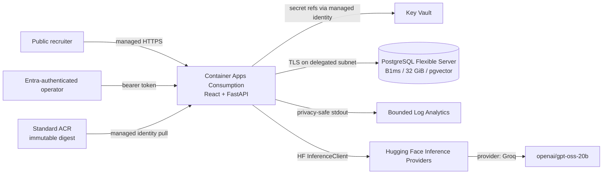

# Azure OpenWeight architecture

## Status and invariant

D19D implements this architecture in source only. Provider plugins were
initialized locally with the Terraform backend disabled for schema validation.
No Azure authentication, remote-state initialization/access, plan/apply,
resource creation, secret creation, container upload, model call, or deployment
occurred.

The model is not the security boundary. GPT-OSS can propose or explain; backend
authentication, authorization, typed validation, deterministic policy checks,
explicit approval, the fixed executor, PostgreSQL constraints, and durable
audit state remain authoritative.

## Runtime topology



The one CPU application container serves the compiled frontend and FastAPI.
GPT-OSS weights never enter Azure. There is no Azure model service, accelerator,
GPU profile, CUDA image, model-weight disk, AKS, API Management, Front Door,
Application Gateway, NAT Gateway, Redis, or private endpoint.

The Qwen query encoder remains the existing CPU retrieval component. Its pinned
public files are preloaded during image construction, and the explicit one-off
policy indexing job populates PostgreSQL. It is not GPT-OSS generation and is
never invoked by deployment verification, `/healthz`, or `/readyz`.

## Public demo versus production identity

Container Apps ingress is external, TLS-only, and unrestricted by source CIDR
when the optional CIDR list is empty. This is deliberate so a recruiter can open
the managed HTTPS URL. Public users can render all portfolio pages, read the
fictional access-request records, and ask bounded free-form Policy & Evidence
questions with grounded citations.

Azure still requires complete Entra issuer/audience/JWKS configuration. A
separate backend switch grants an unauthenticated request only
`agent.query`. It never grants `actions.propose` or `approvals.resume`.
Supplying a malformed token fails closed. React's Reader/Approver/Operator
selector changes interface affordances only; it is not sent as trusted
authorization state.

Therefore the public recruiter posture is honest:

- anonymous visitors can inspect and query the synthetic portfolio;
- they can see the governed-action flow and observe an authorization challenge;
- Entra-assigned operators/approvers can exercise the real proposal, durable
  checkpoint, human decision, fixed update, and idempotency-ledger path;
- production deployment would normally disable anonymous reads or place them in
  a separately governed demo environment.

## Secrets and identities

Terraform creates no secret payload. Operations later create three values in
Key Vault: the bootstrap database administrator password, the runtime database
password, and a distinct inference-only HF token. The Azure HF token belongs to
the same Hugging Face account as the Space credential so routed usage bills to
that account, while remaining independently revocable.

Container Apps references versionless Key Vault URIs. Azure RBAC is scoped to
individual secret resources:

| Identity | Allowed | Not allowed |
|---|---|---|
| Runtime managed identity | ACR pull; runtime DB password; Azure HF token | DB admin secret, ACR push, deployment |
| Temporary migration identity | ACR pull; DB administrator and application secrets | HF token, application deployment |
| Temporary policy-index identity | ACR pull; application DB secret | DB administrator secret, HF token, application deployment |
| GitHub OIDC CI identity | ACR push; update the one app after it exists | Key Vault data, database data, subscription-wide ownership |

The migration identity/job exists only during `migration` or
`maintenance_migration`;
the separately privileged policy-index identity/job exists only during
`indexing` or `maintenance_indexing`. Moving to `application` removes both
elevated paths; each maintenance variant retains the running app while enabling
exactly one reviewed privileged path.

## PostgreSQL bootstrap and readiness

PostgreSQL is private-only behind the existing delegated-subnet/private-DNS
design, with TLS verification, B1ms, fixed 32 GiB/P4 (auto-grow disabled),
seven-day backup, no HA, and no geo backup. Terraform allowlists `vector`, but never pretends allowlisting
creates the extension.

The manually triggered migration job takes an advisory lock and applies additive
versioned migration 1. It creates `vector`, the operations tables, durable
approval sessions, execution ledger, LangGraph checkpoint tables, policy vector
table, runtime login, and narrow grants. Fictional operations seeding is an
explicit flag on that job. A protected migration ledger records completion.

Policy embeddings are a second manual job so a schema migration never silently
executes a model. It runs only after migration succeeds. The app is created only
after both jobs are verified. Ordinary app deploys never run either job.

The small portfolio corpus deliberately uses exact pgvector scanning. D19G
creates neither HNSW nor IVFFlat; ANN remains a later measured optimization.

`/healthz` checks process liveness only. `/readyz` performs bounded,
read-only checks for configuration, PostgreSQL connectivity, checkpoint and
approval tables, the vector extension, a nonempty policy index, and presence of
the HF credential. It does not generate text or embed a query.

## Terraform and first deployment ordering

```mermaid
flowchart LR
    state[State bootstrap\nStandard LRS] --> foundation[Terraform foundation]
    foundation --> image[Azure CD build_only\nmodel-free migration digest]
    image --> secrets[Operator creates\nKey Vault secrets]
    secrets --> jobs[Terraform migration\nmanual migration job only]
    jobs --> verify[Run and verify migration]
    verify --> index[Separate indexing stage\nmodel-enabled digest]
    index --> application[Terraform application\ndigest-pinned app]
    application --> steady[CI-gated steady-state CD]
```



The state root is intentionally separate and initially local. It defines a
Standard LRS StorageV2 account, private container, Entra data-plane RBAC, shared
keys disabled, TLS, versioning/change feed, soft deletion, and destroy guards.
The application backend then uses OIDC/Entra authentication and blob locking.

## CI/CD trust and release

`.github/workflows/deploy-azure.yml` is independent from Hugging Face CD. Its
job is safely skipped until the repository-level non-secret variable
`AZURE_DEPLOY_ENABLED` is exactly `true`. This gate remains absent through the
D19D merge and is set only after the GitHub Environment, federation, variables,
and Azure foundation are ready. Once enabled, a successful push-triggered CI
run for canonical `main` starts the job. The workflow rechecks that the tested
SHA is still current main before requesting an OIDC token. The federated
subject is exactly:

```text
repo:JosephATerry/openweight:environment:azure-production
```

The protected GitHub Environment supplies non-secret tenant, subscription,
client, resource-group, registry, and app identifiers. No client secret exists.
PR code cannot satisfy the workflow-run conditions or environment subject.
Deployments are serialized without cancellation.

The job builds one production image with the recruiter UI and pinned CPU query
encoder, pushes a commit tag, resolves the ACR manifest digest, and updates the
app with `repository@sha256:...`. It waits for a healthy revision, verifies
that exact deployed image, then calls only `/healthz` and `/readyz`.
Revision names, the previous ready revision, and reviewed rollback guidance are
written to the job summary. It never automatically calls HF/Groq or rolls back.

The manual `build_only` dispatch exists solely to break the first-deploy
ordering. It requires the separate `AZURE_BUILD_ENABLED=true` gate and forces
`OPENWEIGHT_PRELOAD_DEMO_EMBEDDINGS=false`; it cannot deploy the app, apply
Terraform, start a job, or modify the database. Normal deployments still
require `AZURE_DEPLOY_ENABLED=true` and successful CI.
The Hugging Face Space workflow, Trusted Publisher, runtime secret, profile,
portable state, and public URL remain separate and unchanged.

## Cost controls

The design keeps spending protection intact and does not require Pay-As-You-Go:

- Standard ACR matches the new-customer one-registry/100-GiB allowance;
- PostgreSQL B1ms plus 32-GiB data and backup matches the initial allowance;
- Container Apps Consumption scales the app to zero and caps it at one replica;
- 1 vCPU/2 GiB is reserved only while a request is active;
- Log Analytics is capped at 1 GiB/day with 30-day retention;
- unused Application Insights is omitted;
- no fixed-cost edge, egress, cluster, accelerator, or premium networking layer
  is present.

Allowances are time-, offer-, region-, and subscription-dependent. D19E must
confirm them in the portal, review the cost estimate, and retain the existing
$70 subscription budget alerts before any apply.
